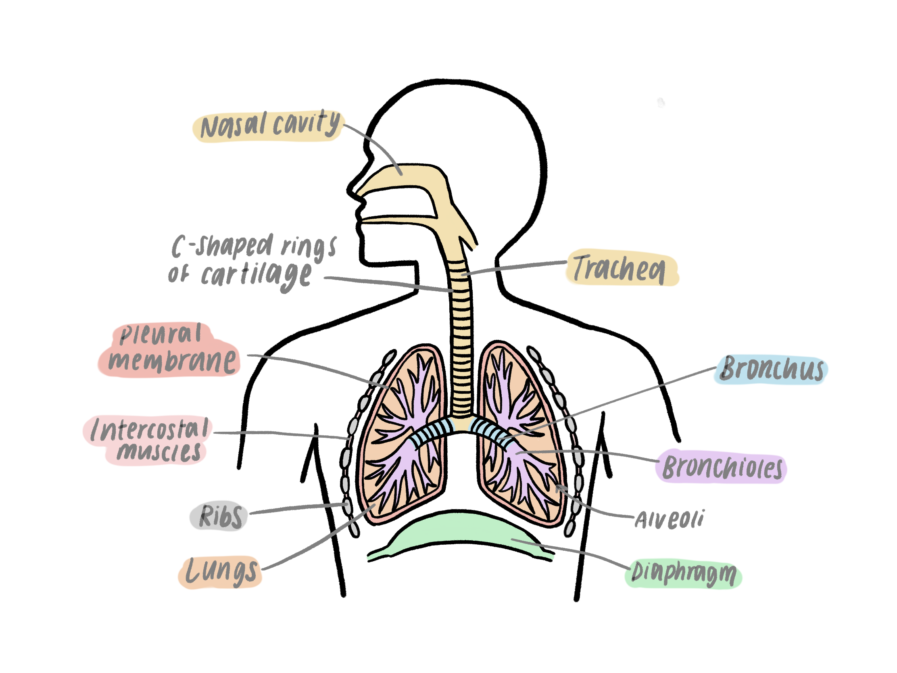
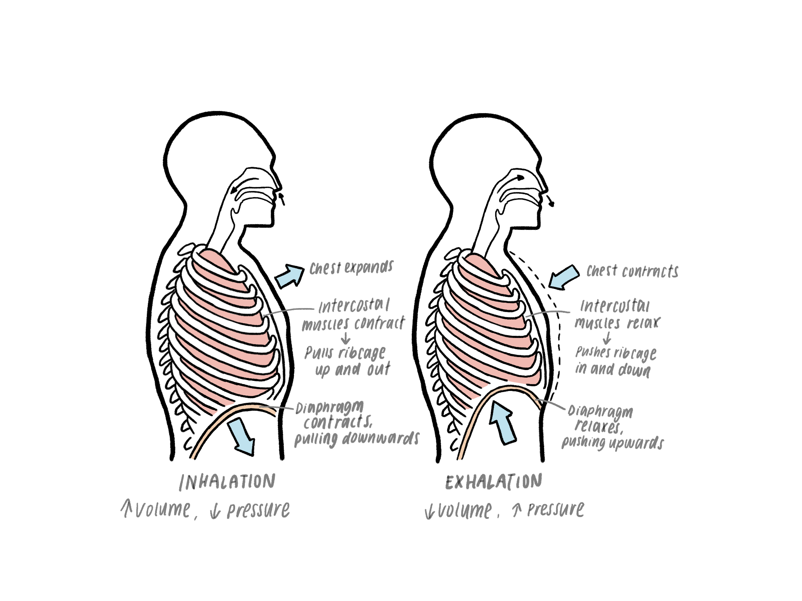
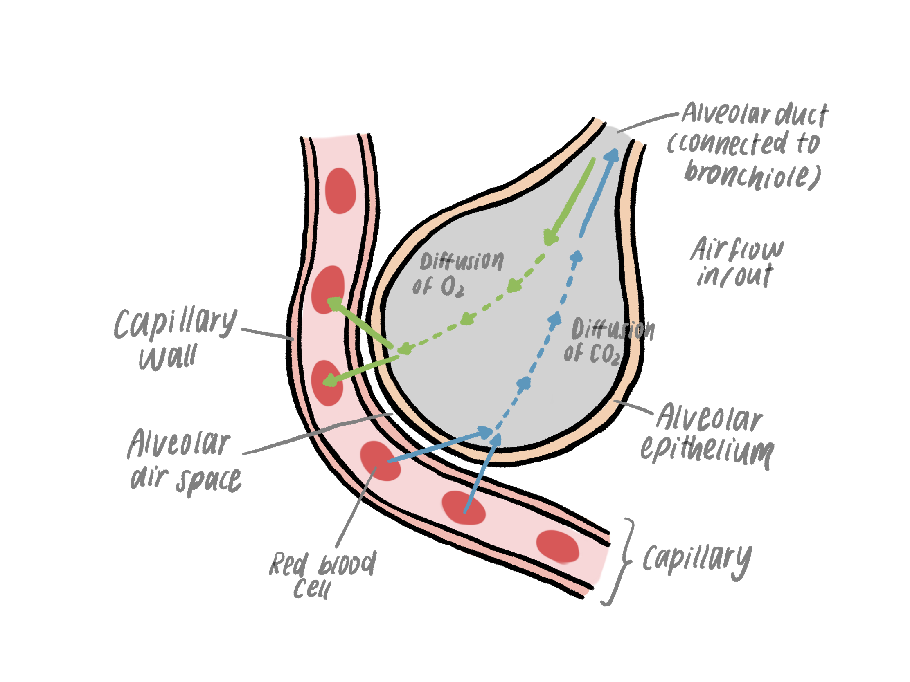

*2.46 describe the structure of the thorax, including the ribs, intercostal
muscles, diaphragm, trachea, bronchi, bronchioles, alveoli and pleural
membranes*

*2.47 understand the role of the intercostal muscles and the diaphragm in
ventilation*

*2.48 explain how alveoli are adapted for gas exchange by diffusion between air
in the lungs and blood in capillaries*

*2.49 understand the biological consequences of smoking in relation to the lungs
and the circulatory system, including coronary heart disease*

*2.50 practical: investigate breathing in humans, including the release of
carbon dioxide and the effect of exercise*

Parts of the thorax
===================

Thorax = area located between neck and abdomen

Intercostal muscle

-   Muscles that control the ribs during inhalation and exhalation

Diaphragm

-   Sheet of muscle at the bottom of the thorax which helps with inhalation and
    exhalation

Trachea

-   Windpipe that connects the mouth and nose to the lungs

-   C-shaped rings of cartilage support the trachea and keep it open

Bronchi

-   Extensions of the trachea that move air in and out of each lung

Bronchioles

-   Bronchi split into thinner tubes called bronchioles

-   Supplies alveoli

-   Called the “bronchiole tree” as it is shaped like a tree with branches and
    thinner extensions

Lung

-   Organ where gas exchange occurs. Made of millions of blood capillaries

-   Located inside the lubricated pleural membrane

Pleural membrane

-   Sticks to the outside of the lungs and to the inside of the chest cavity

-   Allows lungs to follow chest movement

-   Lubricates the lungs to reduce friction

Ribs

-   Moved by contractions and relaxations of the intercostal muscles during
    inhalation/exhalation

Ventilation
===========

Changes take place in the thorax to allow air to enter and leave the lungs.

Inhalation (breathing in)

-   Intercostal muscles contract, pulling the ribcage up and out

-   Diaphragm contracts and pulls downwards

-   Volume of the lungs increase, causing pressure to decrease

-   Air is drawn in (higher pressure to lower pressure)

Exhalation (breathing out)

-   Intercostal muscles relax and push the ribcage down and in

-   Diaphragm relaxes and pushes upwards

-   Volume of the lungs decrease so pressure increases

-   Air is pushed out

Alveoli
=======

-   Air sacs at the end of bronchioles

-   Where gas exchange occurs in the lungs

-   During inhalation, oxygen diffuses into the blood by passing through
    alveoli. The blood transports oxygen around the body, so the oxygen can
    later be used for respiration to release energy in cells.

-   During exhalation, carbon dioxide in the blood diffuses out into the alveoli
    and is exhaled to be lost as a waste product of respiration

-   Alveoli have adapted to be suited for gas exchange

1.  **Large surface area** - there are many alveoli in the lungs which are
    tightly packed together to increase the overall surface area rather than
    having just a few large alveoli

2.  **Blood supply** - ensures oxygen can be taken away by the blood and carbon
    dioxide can be lost from the blood

3.  **Large diffusion gradient** - oxygen is quickly transported away by the
    blood so there is always a concentration gradient as oxygen can move into
    the capillaries from the alveoli.

4.  **Thin walls** - walls of alveoli are only one cell thick so there is a
    short diffusion distance

5.  **Permeable walls** - allows movement of gas across the permeable membrane
    into and out of capillaries

6.  **Moist walls** - alveolar walls are covered with a moist lining which allow
    gases to dissolve and move across

Consequences of smoking
=======================

Smoking has very harmful effects on the body. There are often 5-6 mark questions
on the exams asking for the consequences of smoking. These are easy marks, all
you have to do is remember the points and make sure you’ve mentioned enough. I
have underlined the words or phrases that generally get you a mark.

1.  Causes infection and bronchitis

-   Normally, cilia (ciliated cells) on epithelial cells lining trachea, bronchi
    and bronchioles clears away mucus. This mucus traps pathogens to prevent
    infection.

-   However, smoking damages the cilia. Cilia become unable to clear mucus, so
    mucus builds up. Pathogens like bacteria get trapped.

-   This leads to infection such as bronchitis.

1.  Causes cancer

-   Cigarette smoke contains carcinogens like tar. (tar and carcinogens are
    sometimes awarded just one mark, but mention both anyway)

-   Carcinogens can cause mutations and lead to cancer of the lungs, mouth,
    oesophagus and throat.

1.  Damages alveoli

-   Smoke damages the walls of alveoli so they break down and join together

-   This decreases the surface area of alveoli and less gas exchange can occur

-   This disease is called emphysema

1.  Carbon monoxide

-   This is mainly about the circulatory system, only mention this point if it
    says the effect of smoking in general. If the question asks for the effect
    of smoking on the respiratory system, do not mention it as you won’t be
    awarded points.

-   Carbon monoxide (CO) from tobacco smoke binds to haemoglobin in the blood.

-   The blood can carry less oxygen

-   Less oxygen reaches the heart so it respires anaerobically, producing lactic
    acid

-   Build up of lactic acid leads to diseases like coronary heart disease.
