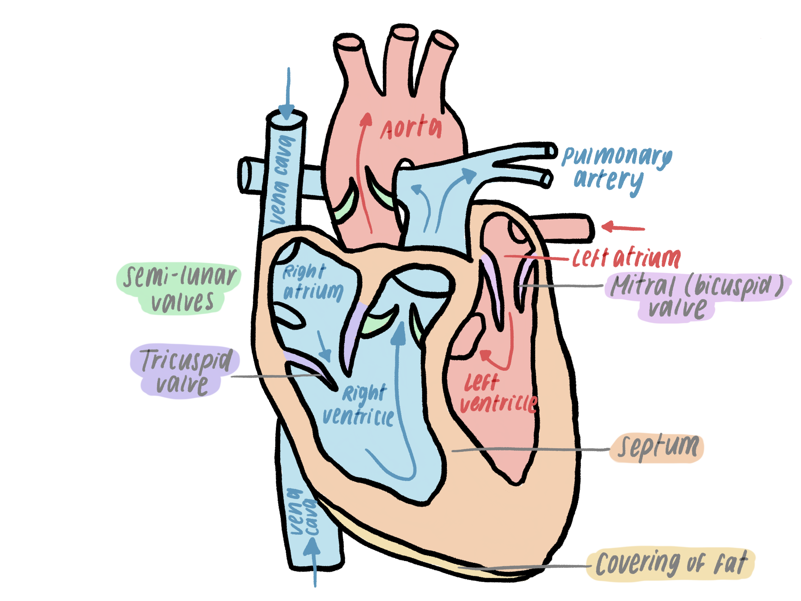
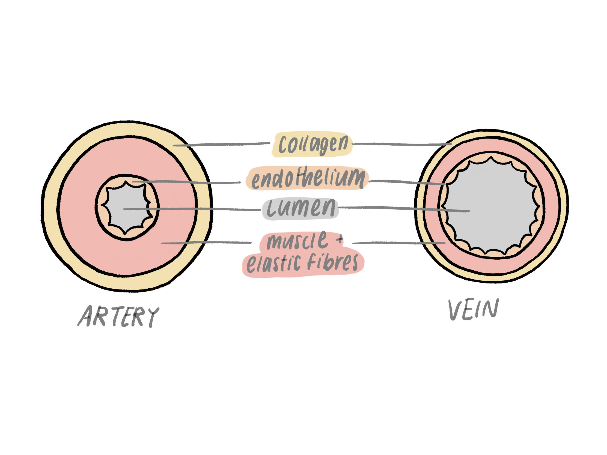
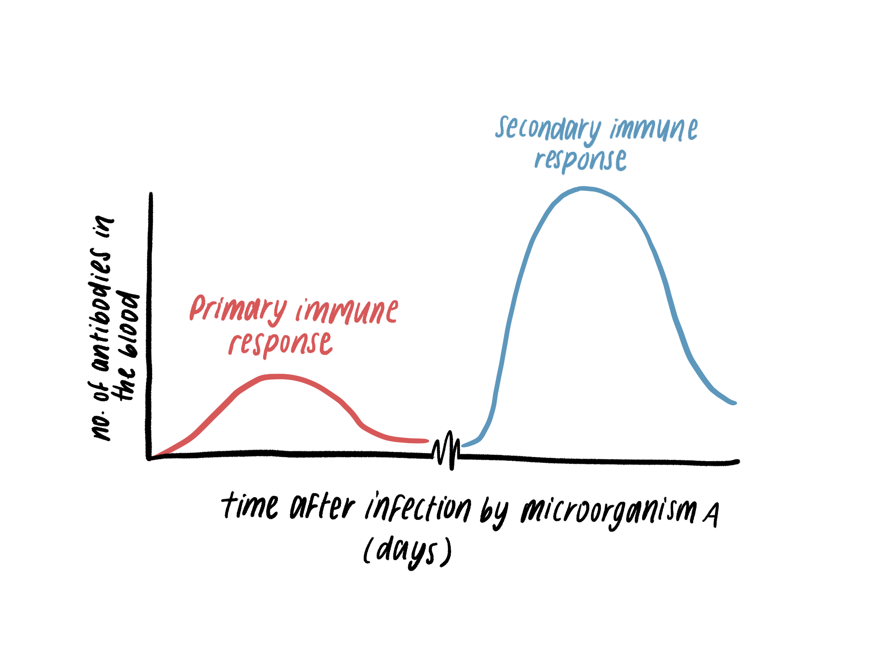

*2.51 understand why simple, unicellular organisms can rely on diffusion for
movement of substances in and out of the cell*

*2.52 understand the need for a transport system in multicellular organisms*

*2.59 describe the composition of the blood: red blood cells, white blood cells,
platelets and plasma*

*2.60 understand the role of plasma in the transport of carbon dioxide, digested
food, urea, hormones and heat energy*

*2.61 understand how adaptations of red blood cells make them suitable for the
transport of oxygen, including shape, the absence of a nucleus and the presence
of haemoglobin*

*2.62 understand how the immune system responds to disease using white blood
cells, illustrated by phagocytes ingesting pathogens and lymphocytes releasing
antibodies specific to the pathogen*

*2.63B understand how vaccination results in the manufacture of memory cells,
which enable future antibody production to the pathogen to occur sooner, faster
and in greater quantity*

*2.64B understand how platelets are involved in blood clotting, which prevents
blood loss and the entry of micro-organisms*

*2.65 describe the structure of the heart and how it functions*

*2.66 explain how the heart rate changes during exercise and under the influence
of adrenaline 2.67 understand how factors may increase the risk of developing
coronary heart disease*

*2.68 understand how the structure of arteries, veins and capillaries relate to
their function*

*2.69 understand the general structure of the circulation system, including the
blood vessels to and from the heart and lungs, liver and kidneys*

Circulatory Systems
===================

Unicellular organisms

-   Have a high surface area to volume ratio and a short diffusion distance

-   The cell surface membrane is a large enough area to supply the demand

-   Therefore unicellular organisms can rely on diffusion

Multicellular organisms

-   Small surface area to volume ratio

-   Not enough surface to supply the volume by diffusion, in addition to a very
    large diffusion distance

-   They have adapted by developing transport systems, needed to move nutrients
    and waste products around the organism

Circulatory system works to transport oxygen, as well as other dissolved
nutrients (eg. glucose) and waste products to excrete them from the body (eg.
carbon dioxide). There are 2 types of circulatory systems in vertebrates.

1.  Single circulatory system

-   Found in fish.

-   Blood is pumped from the heart to the gas exchange organ then directly to
    the rest of the body without revisiting the heart.

-   Only one atrium and one ventricle

-   For each circulation, blood passes the heart once

-   Blood loses pressure when it passes through capillaries in the lungs

    -   Travels more slowly

    -   Less efficient

1.  Double circulatory system

-   Found in mammals

-   Blood is pumped from the heart to the gas exchange organ, back to the heart,
    then the rest of the body

-   Passes through the heart twice during one circuit

    -   More efficient as higher blood pressure can be maintained when passing
        through the heart

    -   Blood travels more quickly to organs

-   2 parts to a double circulatory system:

    -   Pulmonary circulation = deoxygenated blood leaves the heart to lungs
        through pulmonary arteries. It becomes oxygenated in the lungs, and
        returns to the heart by pulmonary veins

    -   Systemic circulation = blood leaves through the aorta to the body and
        returns through the vena cava

The Heart
=========

-   The heart has four chambers: two ventricles and atriums.

-   There are valves between the atrium and ventricle, ventricle and artery
    which prevent backflow of blood.

    -   The tricuspid valve is found between the right atrium and ventricle

    -   The bicuspid (mitral) valve is found between the left atrium and
        ventricle

    -   There are semi-lunar valves in the arteries, and between the artery and
        ventricle

-   The left and right sides of the heart are divided by a wall called the
    septum

-   Deoxygenated blood moves through the right side of the heart, from the body
    to the lungs.

-   Oxygenated blood moves through the left side of the heart, from the lungs to
    the body.

-   Arteries move blood away from the heart, veins move blood into the heart

Blood Vessels
=============

There are three kinds of blood vessels: arteries, veins, and capillaries.

1.  Artery

-   Carries blood from the heart to other organs of the body

-   Pumps high pressure blood from the ventricles

-   It has a small lumen (internal space within the blood vessel). The small
    lumen maintains the high blood pressure as there is a smaller volume,
    leading to higher pressure.

-   The artery has a thick layer of muscle and elastic fibres

    -   allows the blood to be squeezed long distances across the body

    -   Ensures the vessel can withstand high pressures

1.  Vein

-   Carries blood from organs and back to the heart

-   Veins have a thinner wall of muscle and elastic fibre

    -   Pressure of the vein’s blood is much lower than arterial blood

    -   Less pressure means there is less need for muscle

-   Wider lumen as there is lower pressure blood

-   They have semilunar valves which open when blood flows in one direction and
    close when blood flows in the opposite direction

    -   Prevents backflow of blood

    -   Necessary as many veins have to travel against gravity

1.  Capillary

-   Carries blood through organs

-   Has a semi-permeable endothelium which allows diffusion of different
    substances

    -   Therefore used as an exchange surface

-   The walls are one cell thick, meaning there is a short diffusion distance

Adaptations of the heart
------------------------

The heart has adapted for its function in a few ways.

-   Walls of the heart are made from cardiac muscle

    -   The muscle can contract and relax continuously without getting fatigued

    -   The cardiac muscle also has its own blood supply for a constant source
        of oxygen used to release energy in respiration (coronary arteries and
        veins)

-   Atria walls are thin and flexible

    -   The walls can stretch when receiving blood

    -   They can also contract with enough force to open valves

-   There is a wall between the ventricles called the septum

    -   Thick wall which prevents the mixing of oxygenated and deoxygenated
        blood

    -   More efficient transportation of oxygen

-   The left ventricle wall is thick

    -   Contains a lot of muscle and fat

    -   Muscle is needed to pump high pressure blood around the body (as the
        left ventricle leads to the aorta which is the artery in charge of
        moving blood to the body)

-   Covering of fat on the bottom of the heart

    -   Extra energy source for respiration

Cardiac Cycle
=============

= how blood is moved through the heart by a series of contractions and
relaxations of the muscles in the four chambers.

1.  Blood enters the atria. It cannot pass into the ventricles because the
    tricuspid and bicuspid valves are closed.

2.  Walls of the atria contract, which raises the blood pressure. The increased
    blood pressure forces the closed valves open.

3.  Blood passes through the valves and into the ventricles

4.  When the ventricles are filled with blood, they contract. This increases
    blood pressure in the ventricles and closes the valves so blood cannot flow
    back to the atria

5.  Ventricles continue to contract and pressure continues to increase. The
    pressure forces open the semi-lunar valves at the base of the arteries:
    aorta and pulmonary artery.

6.  Blood is ejected into these arteries

7.  The ventricles empty and higher pressure in the arteries close the valves.

8.  Cycle repeats.

In an exam you may be asked to explain how blood is moved from a specific
ventricle or how blood is moved to a specific artery through the heart. In that
case, you should use the steps above but mention the correct ventricle, atrium
and valve names

-   Eg. if you’re asked how blood is moved to the pulmonary artery, mention
    only: the vena cava, tricuspid valve, right atrium and ventricle.

You may also need to apply this idea of moving fluid (blood) through
contractions and relaxations to diagrams + predict where the fluid moves:

Changes in Heart Rate
=====================

Heart rate can change due to 3 different factors:

1.  Exercise

-   Heart rate increases

-   Muscles need more energy due to increased movement

-   They therefore need an increased supply of oxygen as cells need oxygen for
    aerobic respiration to release energy

-   Oxygen is carried in haemoglobin (binding to form oxyhaemoglobin) of red
    blood cells

-   More blood needs to be transported to ensure sufficient oxygen is provided
    to muscles

1.  Secretion of adrenaline hormone

-   Heart rate increases

-   Triggers increased oxygen output to muscles to release extra energy

-   Prepares the body for a ‘fright or flight’ response

1.  Sleep

-   Heart rate decreases

-   Organs and muscles are working more slowly

-   They need less energy = less oxygen is needed to be supplied

How does the body increase and decrease heart rate based on how much oxygen is
needed during exercise?

-   At the start of exercise, the muscles begin to produce more CO2 due to
    aerobic respiration.

-   The CO2 is transported in the blood.

-   Receptors in the aorta and carotid artery detect the increase of CO2, and
    send nerve impulses (through sensory nerves) to the medulla

-   The medulla responds by sending impulses along the accelerator nerve,
    increasing heart rate.

-   After exercise, when CO2 production returns to normal, the medulla receives
    fewer impulses.

-   It responds by sending nerve impulses down the decelerator nerve (which
    reduces the force of contractions of the heart)

Circulation System
==================

-   The pulmonary artery leads into the lungs, then the pulmonary vein leads
    from the lungs into the heart

-   The hepatic artery leads into the liver, then the hepatic vein leads back
    from the liver into the heart

-   The renal artery leads into the kidneys, then the renal vein leads back from
    the liver into the heart

Composition of the Blood
========================

Blood is made of 4 main parts:

1.  Plasma 54%

2.  Red blood cells 45%

3.  White blood cell \<1%

4.  Platelets

The red blood cell
------------------

Red blood cells are also known as erythrocytes. They are specialised cells made
in the bone marrow. Their main function is to carry oxygen around the body. The
cells have adapted to carry oxygen more efficiently in different ways.

Carries haemoglobin

-   RBC contains haemoglobin, an iron-containing protein.

-   Haemoglobin ‘loads oxygen’ = bonds with oxygen to form oxyhaemoglobin when
    there is a high concentration of oxygen in the surroundings.

-   When oxygen concentration is low, oxyhaemoglobin turns back to haemoglobin
    and oxygen (‘unloads’)

-   Therefore it is a reversible reaction: haemoglobin + oxygen **⇌**
    oxyhaemoglobin

No nucleus

-   No nucleus means it has a larger internal space to store more haemoglobin

-   Carrying more haemoglobin means each red blood cell can transport more
    oxygen at the same time, so it is more efficient

Biconcave disc shape

-   Special shape, increases the RBC’s surface area to volume ratio

-   This means the RBC has a larger area for diffusion

-   It is also very thin, meaning there is a short diffusion distance

-   The shape is optimised for diffusion

White blood cells
-----------------

It is part of the immune system and helps to protect the body against pathogen
invasion.

1.  Phagocytes

-   Make up about 70% of WBCs

-   Phagocytes engulf pathogens and destroy them in a process called
    phagocytosis:

    -   The phagocyte changes shape, producing extensions of the cytoplasm
        called pseudopodia

    -   The pseudopodia surround and enclose the pathogen in a vacuole

    -   The phagocyte secretes digestive enzymes into the vacuole which breaks
        down the pathogen

1.  Lymphocytes

-   Makes up about 20% of WBCs

-   Their main function is to make antibodies, soluble proteins that pass into
    the plasma part of the blood

-   Pathogens have antigens (‘markers’) on their surface which are recognised by
    the antibodies

-   The antibodies stick onto the surface antigens and destroy the pathogen.
    This is done in a few ways:

    -   Antigens ‘label’ the pathogen for phagocytes to break down

    -   Antigens neutralise the toxins produced by the pathogen

    -   Antigens make cause bacterial cells to burst open

-   Some lymphocytes do not get involved in destroying pathogens, and instead
    develop into memory cells.

-   Memory cells remain in the blood for long periods of time. If the same
    pathogen re-infects a person, the memory lymphocytes reproduce quickly and
    produce antibodies so the pathogen is destroyed more quickly

    -   This is called immunity

Primary and secondary immune response

-   Production of antibodies following the first exposure to a foreign antigen
    (basically, the first time your immune system has come across a particular
    pathogen) is called the primary immune response

-   The secondary immune response is when your body has memory cells and so can
    react much more quickly to destroy the pathogen

-   Secondary immune response is much faster and more effective than primary

    -   Antibody production occurs sooner, faster, and in greater quantity

Vaccinations
------------

-   A person can be given artificial immunity to a pathogen without contracting
    it using vaccinations

-   Process:

    -   Person is injected with an antigen-carrying agent

    -   Lymphocytes recognise the antigens and react as though they are the real
        pathogen

    -   The body produces memory cells, and provides immunity to the pathogen

    -   In future, if the person contracts the pathogen, they will experience a
        secondary immune response so can fight back more easily

-   Agents include:

    -   Weakened strain of or dead microorganism

    -   Modified toxins of the bacteria

    -   The antigens alone

    -   Genetically engineered bacteria to carry antigens without releasing
        toxins (which cause the symptoms)

Platelets
=========

They are fragments of larger cells that are made in the bone marrow responsible
for the clotting of blood. Clotting is important as it prevents further loss of
blood and entry of microorganisms.

Clotting process

-   When the skin is cut, exposure to the air stimulates the platelets and
    damaged tissue to produce a chemical

-   This chemical causes the soluble plasma protein called fibrinogen to become
    insoluble fibres of protein called fibrin.

-   Fibrin forms a network across the wound

-   Red blood cells become trapped in the network of fibrin and form a clot.

-   The clot develops into a scab which protects damaged tissue while new skin
    grows

**Plasma**

-   Liquid part of blood, mainly made up of water

-   Carries blood cells around the body

-   Contains dissolved nutrients (eg. glucose), hormones, and waste products
    (eg. urea, CO2)

-   Distributes heat around the body

-   In an exam, never just say ‘nutrients’ or ‘waste products’. You must give an
    example or you may not receive the mark as it is too vague.

Coronary Heart Disease (CHD)
============================

The coronary arteries supply blood to the cardiac muscle in the heart. They are
very narrow and are easily blocked by a build-up of fatty substances in the
muscles (eg. cholesterol).

-   Affected muscles do not receive glucose and oxygen as the blood cannot flow
    or flows much slower

-   They are unable to respire, leading to a heart attack

There are factors which make CHD more likely:

-   Heredity - you can inherit a tendency to develop CHD in your genes

-   High blood pressure - places strain on the heart muscle. Blood pressure may
    be increased by

    -   Stress

    -   Smoking

-   Diet - saturated fats increase cholesterol levels which create a build up of
    fatty substances and blocks the arteries

-   Exercise - regular exercise reduces blood pressure and strengthens the heart
    muscle
