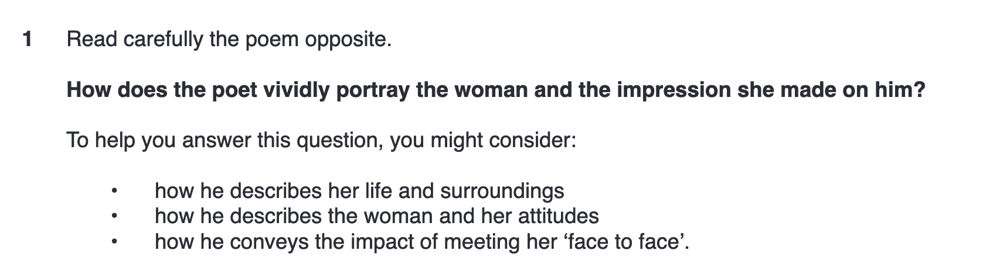

*In this five part series, I'm going to show you how to ace your Cambridge IGCSE
World Literature Course, taking you through everything teachers don't show you.
I promise you that IGCSE English is a course with incredibly limited scope, and
it's easy to manipulate this to your advantage and score high marks with ease.
It always tackles the same themes, looks for the same things in your writings,
and it's acknowledging this will help you. This article focuses on the Cambridge
IGCSE World Literature Unseen Paper 4, specifically on the poetry analysis for
this paper. We're working for a similar series of articles on prose.*

Here's the deal- getting top band in the Cambridge IGCSE World Lit Paper 4 is
easy if you know what to look for. It's just a matter of **timing yourself well,
generating a high quality thesis**, **knowing which techniques get you the
marks** and **linking the text to a cultural context.** Let's get started.

English Teachers will tell you that there is no right or wrong answer, and that
if you can justify what you write then it's all good. That's true, but as a
fellow student, I can assure you that getting marks in an exam is different from
writing a good essay overall.

>   There is a "right" way to write so that you get marks on an IGCSE Exam.

As a student, I find it helpful to think from the point of view of an examiner.
What makes you look smart in their eyes? What sort of points and quotes will
show them that you best understand what the poet is doing and how?

The Bare Minimum You Have To Know- What Does the Test Look Like?
================================================================

-   You get a 75 minute test with a poem, an extract from an extended piece of
    prose, and two questions. You pick between

-   For example:

-   Note the guiding bullet points that explain what you need to include to get
    the marks on this paper

Timings- How to Make the Most of your Time
==========================================

For your essay, you should be looking for around 4 to 5 body paragraphs, an
introduction, and a conclusion. With only 75 minutes to read the poem and write
your essay, how you break down your time is incredibly important. Here's how I
take my time:

1.  Read the question BEFORE the poem, so you know what you have to focus on (2
    minutes)

    -   This means that you will read the poem through the lens of the question,
        add know exactly what you're looking for

    -   Questions always come with several bullet points that help you with
        guiding your content. An early mistake I made was ignoring these -
        **they're there for a reason**.

    -   Make sure you understand what the question is really asking for

2.  Read the poem (2 minutes)

    -   Make sure you understand what the plot and themes is, and are sure of
        that. If you struggle with this step, maybe choosing prose as a text is
        better for you.

    -   Highlight, underline, annotate, scribble all over your page. Note down
        important things, write your thoughts onto paper

    -   Come up with a core thesis that makes it easy to integrate the bullet
        point tips.

3.  Plan your essay(8 minutes)

    -   You have 4 to 5 separate body paragraphs. Each one will need a separate
        topic sentence that links into your overarching thesis

    -   Now, find quotes and techniques in the poem that are relavant to your
        points. More on that later

4.  Write your essay (60 minutes)

    -   I'd say spend 10 minutes tops per paragraph. Around 5 is what you're
        aiming for.

What Analysis Works Best?
=========================

If it helps you, try to focus on one obvious theme, and analyze everything from
the perspective of this on theme.

An examiner will want to tell that you really know Literature well and you can
analyze whatever comes in front of you. So, it looks really good if you have
techniques that are relavant only to a very specific text type. With poetry, you
want to use poetry specific techniques.

Top tips:

-   Integrate a wide range of techniques, especially those relavant to poetry

    -   You'll want to integrate at least two of the following:

        -   Figurative language

            -   Metaphors, similes, etc- the bare bones

        -   Structural techniques

            -   Meter - how the rhythm of a poem sounds

            -   End-stopping - when a line of a poem ends with a punctuation
                mark such as a full stop

            -   Enjambment - when a sentence runs over a line

            -   Caesura - when a line is split by a puncutation mark

        -   Sonic techniques

            -   Alliteration - the repetition of certain sounds

            -   Some other useful words:

                -   Fricatives are "soft" consonants like *f,s* and *th*

                -   Plosives are "hard" consonants like *t, k, p, d, g*, and *b*

        -   Keep in mind this is a brief introduction, and like you I am a
            student. Look this stuff up for further guidance

-   Use evidence selected from all over the poem

    -   This shows that you understand the broader text, and also the context in
        which your quotes sit

Introductions and Conclusions
=============================

Let's cut to the chase. In an introduction and conclusion, you **don't** want
to:

-   Add a new argument, or point

    -   This will mess with the structure, and dilute the value of your body
        paragraphs

-   Reiterate what is said in the body paragraphs without adding anything of
    value

    -   Self explanatory. The instructor has just read your essay after all- you
        don't need to summarize it for them

Instead of seeing the introduction and conclusion as summaries of your writing,
here's how I would view the paragraphs:

-   Introductions are for **introducing** the poem, hence the name. Think of it
    as introducing a friend

    -   Introduce their context:

        -   With a friend, you'd say, *hey, this is Steven, my friend from
            Football*

        -   With a poem, you'd introduce the cultural context. For example:

        >   In the poem the Early Purges, Seamus Heaney captures a memory from
        >   his childhood on a early twentieth century Irish farm.

        >   Set in presumably a present-day first world country, in a time of a
        >   growing middle class and growing suburbanisation as well as
        >   shrinking families and shrinking free time,

        >   The poem The Bonfire is a bitter 20th century reflection on
        >   humanity's primitive urge to destroy and our obsession with fire, a
        >   tool that separates humanity from apes

        >   Written through the lens of present-day modernisation and
        >   urbanisation, in which food is not hunted for but gathered at
        >   supermarkets

        -   Notice how I'm sometimes assuming a lot about the poem. From what
            I've seen, most IGCSE World Lit papers will use contemporary poems
            written in English.

-   Conclusions

    -   Conclusions, just like introductions, have to add value to whatever it
        is you're writing.

    -   What I like to do in my conclusions, is introduce why what I just wrote
        about was important, adding complexity and appreciation of audience to
        my arguments

        -   For example, in a poem about growing up, I'll talk about suburbs,
            and how that's relavant.

        -   Sometimes I'll fit in something personal. For example, I grew up in
            a former British colony, so if a poem talks about colonisation, I'll
            refer to my personal background and why a poem means a lot to me.

        -   Generally, the IGCSE will select poems that are highly relavant to
            the political and social climate at present, so address those
            issues.
