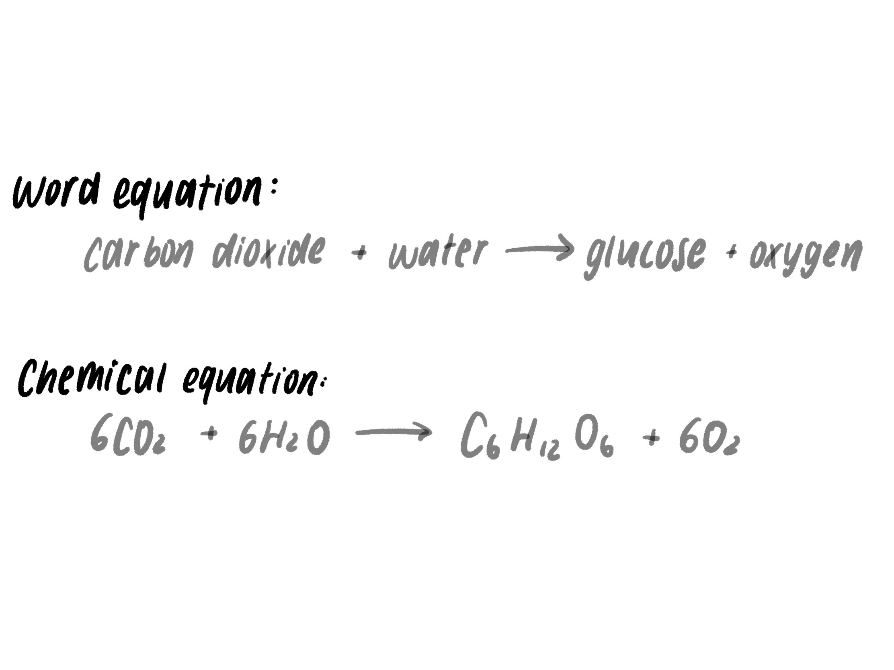
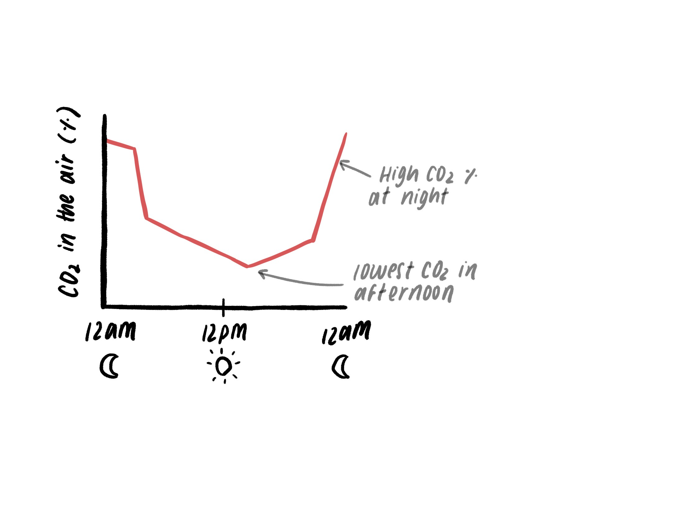
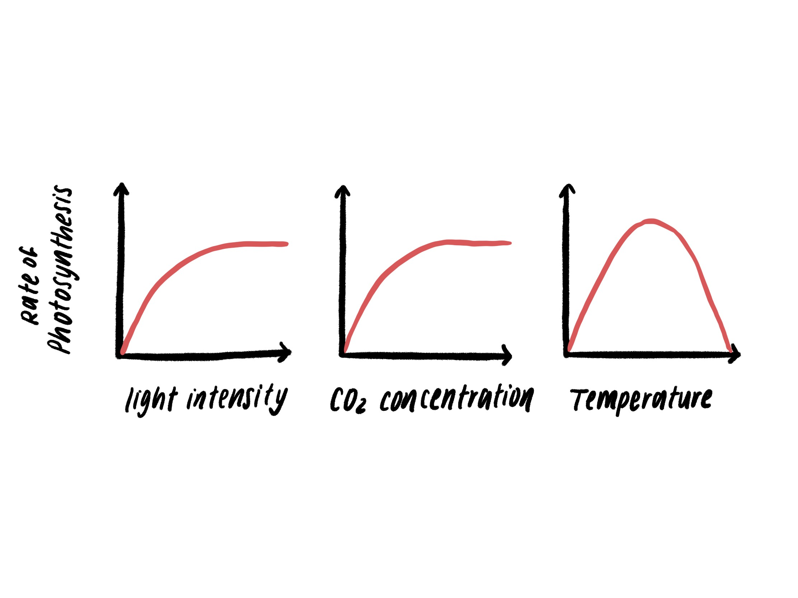
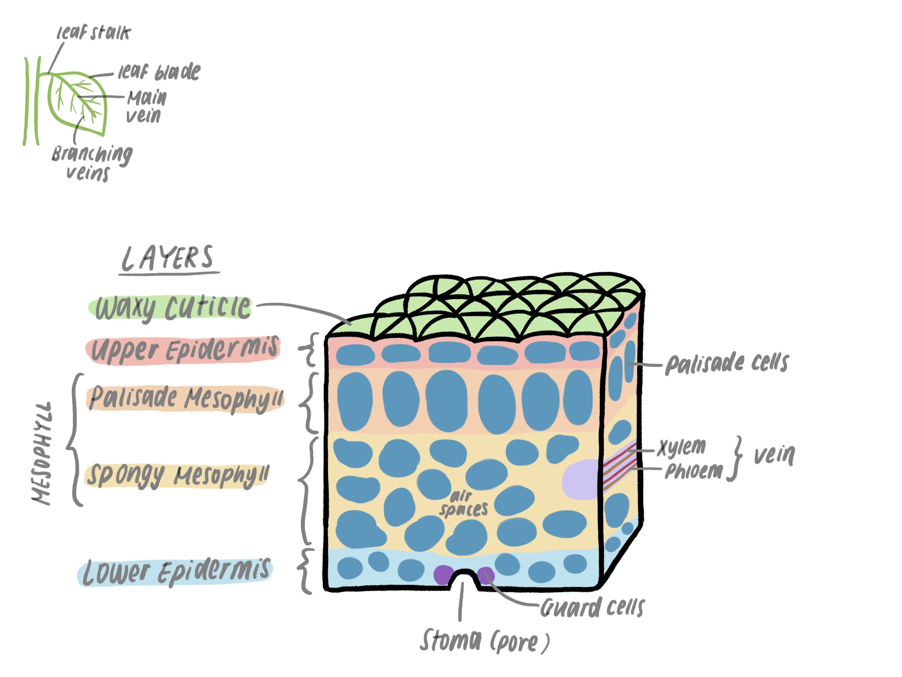

*2.18 understand the process of photosynthesis and its importance in the
conversion of light energy to chemical energy*

*2.19 know the word equation and the balanced chemical symbol equation for
photosynthesis*

*2.20 understand how varying carbon dioxide concentration, light intensity and
temperature affect the rate of photosynthesis*

*2.21 describe the structure of the leaf and explain how it is adapted for
photosynthesis*

*2.22 understand that plants require mineral ions for growth, and that magnesium
ions are needed for chlorophyll and nitrate ions are needed for amino acids*

*2.23 practical: investigate photosynthesis, showing the evolution of oxygen
from a water plant, the production of starch and the requirements of light,
carbon dioxide and chlorophyll*

 

Photosynthesis
--------------

-   Simple organic molecules, carbon dioxide and water, make glucose and oxygen
    in the presence of chlorophyll and light

-   Chemical energy in the product, glucose, comes from the light which is
    trapped by photosynthesis in the chlorophyll (**converts light energy to
    chemical energy**)

 

### Equations

 

### Starch production

-   A plant does not make starch directly.

-   Glucose is produced first from photosynthesis and joined together to form
    starch molecules

 

### Photosynthesis and respiration

-   Concentration of carbon dioxide in the air around a plant changes throughout
    a day

-   There is the lower carbon dioxide levels when photosynthesis occurs in the
    day, and lowest when photosynthesis peaks in the afternoon

    -   Because carbon dioxide absorbed and used for photosynthesis by the
        plants

-   At night carbon dioxide levels rise due to no photosynthesis

    -   Less carbon dioxide absorbed by plants

    -   Carbon dioxide added to air from respiration of all organisms

 

### Effect of different conditions on photosynthesis

Light intensity

-   Increasing light intensity increases the photosynthesis rate

-   Until another factor is in short supply and becomes the limiting factor

-   Without sufficient light, the plant cannot photosynthesise regardless of how
    much carbon dioxide and water there is

 

Carbon dioxide concentration

-   Increasing CO2 concentration increases photosynthesis rate as it is one of
    the products

-   Atmosphere has a set CO2 concentration, but levels can be adjusted in
    **glasshouses (discussed in our Food Production article)**

 

Temperature

-   Enzymes control the chemical reactions in photosynthesis

-   As temperature increases, enzyme rate of reaction increases as particles
    move faster and collide with more energy (activation energy reached more
    easily)

-   However, once the optimum temperature of the enzyme is reached, they begin
    to **denature**

    -   Rate of reaction drops

**Enzymes are discussed in more detail in the article on Biological Molecules**

 

The Leaf
--------

There are layers of cells in the leaf which have different functions.

 

### Upper and lower epidermis

-   Has few chloroplasts (not used for photosynthesis)

-   Covered by a thin layer of a waxy material called the **waxy cuticle**

    -   Reduces water loss by evaporation

    -   Acts as a barrier to the entry of **pathogens** (disease-causing
        microorganisms) such as bacteria and fungi

 

### Stomata

-   The **lower epidermis** has many holes or pores called stomata. The upper
    epidermis has few or no stomata.

-   Allows **carbon dioxide** to diffuse into the leaf and reach the
    photosynthetic tissues (to be used in photosynthesis)

-   Allows **oxygen** (waste product) and **water vapour** (for transpiration
    stream) to diffuse out

-   Each stoma is formed as a gap between two **specialised cells** called
    **guard cells**

    -   Guard cells change their shape to open or close stomata by absorbing
        water and becoming turgid, or decreasing water content and becoming
        flaccid

 

### Palisade mesophyll

-   Tissue made of long, narrow cells

-   Cells contain hundreds of chloroplasts - main site of photosynthesis

-   Located close to the source of light under the relatively transparent upper
    epidermis layer so light can pass through to the chloroplasts

 

### Spongy mesophyll

-   Has fewer chloroplasts than the palisade cells

-   Tissue is made oof round and loosely packed cells with many air spaces -
    main gas exchange surface in the leaf

-   Air spaces allow gases to diffuse in and out of the mesophyll cells

-   Carbon dioxide is absorbed, oxygen and water vapour are released

 

### Xylem

-   Tissue that supplies the leaf through vessels with water and mineral ions

-   Part of a continuous transport system throughout the plant

-   Water absorbed by the roots passes up through the stem into the leaves by
    the transpiration stream.

    -   Water leaves the xylem and supplies the cells in the leaf

 

### Phloem

-   Tissue that carries away products of photosynthesis like sugars (glucose)

-   Supplies the products to other tissues and organs of the plant

 

**Stomata, xylem and phloem are discussed in more detail in our article on
transport in plants**

 

Plant Minerals
--------------

| **Mineral** | **Use**                                      |
|-------------|----------------------------------------------|
| Potassium   | Allows stomata to function, enzyme activator |
| Phosphorus  | Component of DNA genetic code                |
| Magnesium   | Chlorophyll                                  |
| Nitrate     | Make amino acids (for proteins)              |
