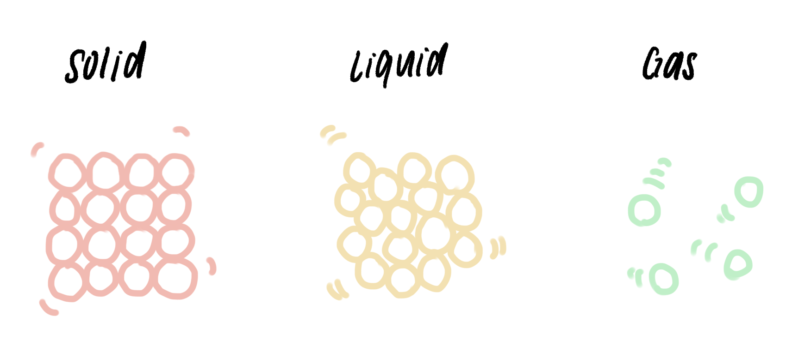
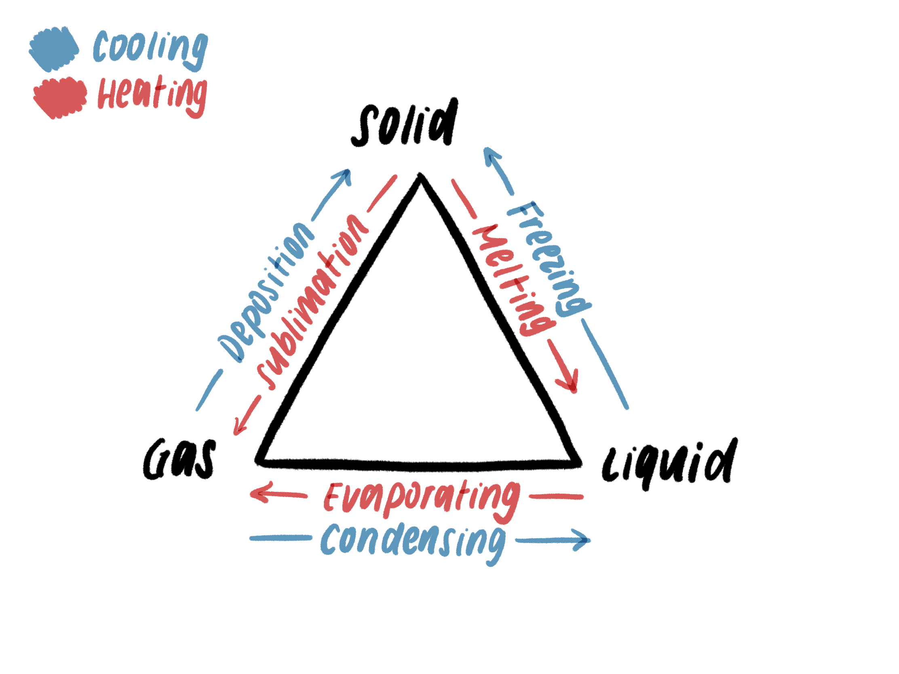
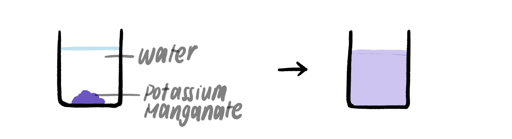

*1.1 understand the three states of matter in terms of the arrangement, movement
and energy of the particles*

*1.2 understand the interconversions between the three states of matter in terms
of:*

-   *the names of the interconversions*

-   *how they are achieved*

-   *the changes in arrangement, movement and energy of the particles.*

*1.3 understand how the results of experiments involving the dilution of
coloured solutions and diffusion of gases can be explained*

*1.4 know what is meant by the terms:*

-   *solvent*

-   *solute*

-   *solution*

-   *saturated solution*

*1.5C know what is meant by the term solubility in the units g per 100 g of
solvent*

*1.6C understand how to plot and interpret solubility curves*

*1.7C practical: investigate the solubility of a solid in water at a specific
temperature*

 

Features of the 3 states of matter
----------------------------------

| **Feature**              | **Solid**                         | **Liquid**                                                         | **Gas**                           |
|--------------------------|-----------------------------------|--------------------------------------------------------------------|-----------------------------------|
| **Particle arrangement** | Close together in regular pattern | Able to move over each other, close together in random arrangement | Far apart, random arrangement     |
| **Volume**               | Fixed, cannot be compressed       | Fixed, cannot be compressed                                        | Can be compressed                 |
| **Shape**                | Fixed shape, cannot flow          | Able to flow                                                       | Able to flow                      |
| **Particle movement**    | Vibrate in fixed positions        | Able to move over and around each other                            | Random movement in all directions |

 

Interconversions
----------------

-   Interconversions, or **changes of state**, are physical changes not chemical
    changes.

 

 

### Heating

-   When a substance is heated, its particles take in thermal energy

-   Thermal energy is converted to kinetic energy and increases their movements

-   When the substance reaches a certain point in temperature, the thermal
    energy is used to overcome the effect of the forces of attraction, rather
    than raising temperature

    -   Forms a straight line on a time-temperature graph

-   **Melting** = solid -\> liquid

    -   Some of the bonds between particles are broken

-   **Evaporating** = liquid -\> gas

    -   All remaining bonds are broken

    -   Boiling is when evaporation is at maximum (evaporation can occur below
        the boiling point)

 

### Cooling

-   When a substance is cooled, the particles lose thermal energy to the
    surroundings and move slower (less kinetic energy)

-   When the substance reaches a certain point, bonds form between particles.

-   **Freezing** = liquid -\> solid

-   **Condensing** = gas -\> liquid

 

-   Certain substances don’t have a liquid form and change from solid to gas or
    gas to solid.

-   **Sublimation** = solid -\> gas

-   **Deposition** = gas -\> solid

 

Diffusion and solubility
------------------------

-   **Solvent** = liquid in which a solute is dissolved to form a solution
    (common solvents include water and ethanol)

-   **Solute** = solid that dissolves into a solvent

-   **Solution** = liquid mixture where the solute is uniformly distributed
    within the solvent

-   **Saturated solution** = point where the solvent cannot dissolve any more
    solute **at that temperature**

 

### Diffusion

-   **Diffusion** = movement of particles from high concentration to low
    concentration

-   Factors affecting diffusion:

    -   Temperature

    -   Concentration gradient (difference in concentration)

    -   Diffusion distance

 

### Solubility

-   **Solubility** = maximum amount of solute which can dissolve in a solvent at
    a given temperature

-   Find solubility:

    1.  Divide mass of solute by mass of solvent

    2.  Multiply by 100g

    3.  Use units g/100g in answer

-   **Solubility curve** = graph that shows solubility against an independent
    variable (e.g. solvent quantity, temperature)

    -   As it is a curve, it allows you to predict solubilities you have not
        tested

*You may be asked to plot a solubility curve in the test and use the x- and
y-axes to make predictions. These are some easy marks, just keep in mind SLAPUK
when you plot the graph and use a ruler to make predictions!!*

 

### Potassium Manganate experiment: explained

 

-   When potassium manganate crystals are dissolved in water, a purple solution
    forms.

-   This occurs because water and potassium manganate particles **move freely**

    -   They can mix and form a solution

-   The final solution is a weaker colour because the potassium manganate
    particles are **less concentrated**

 
