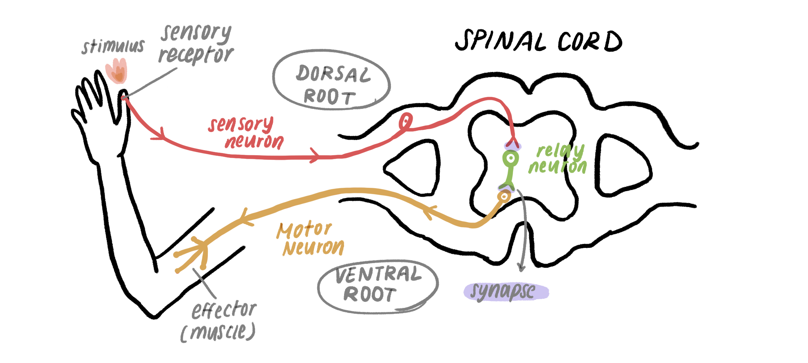
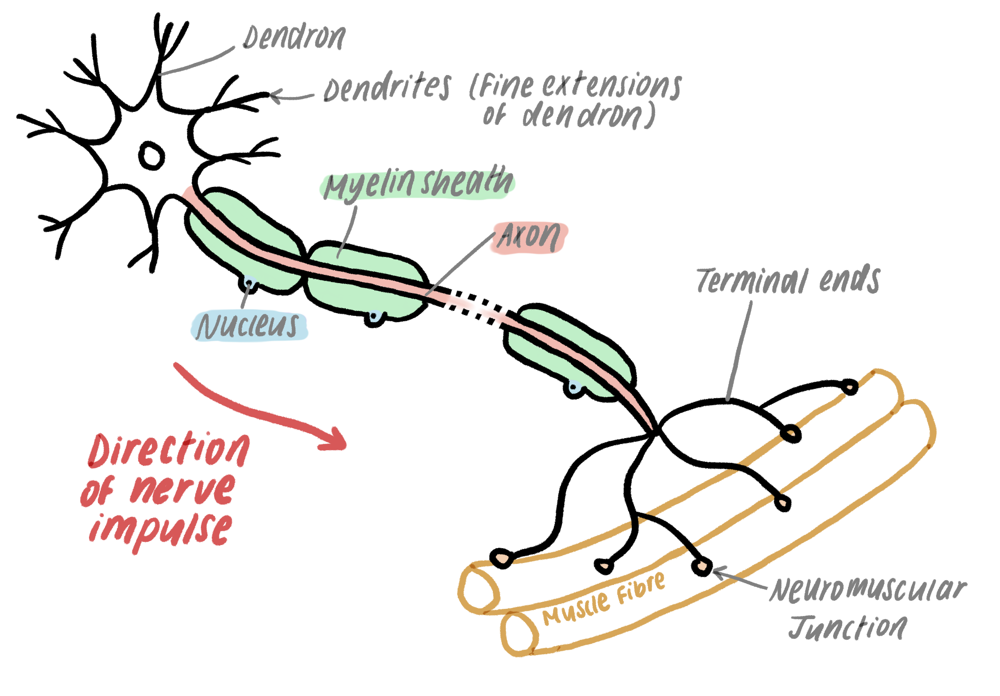
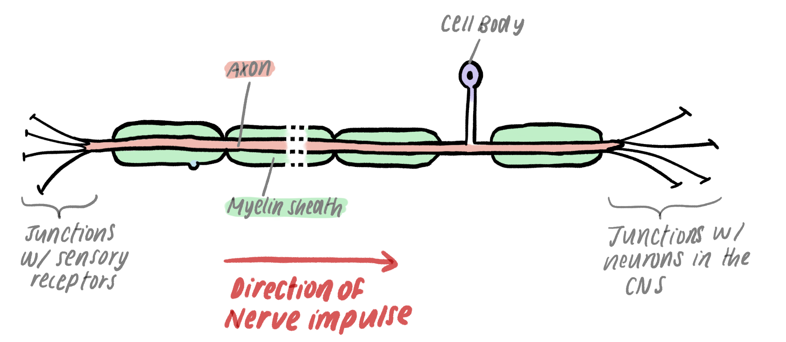
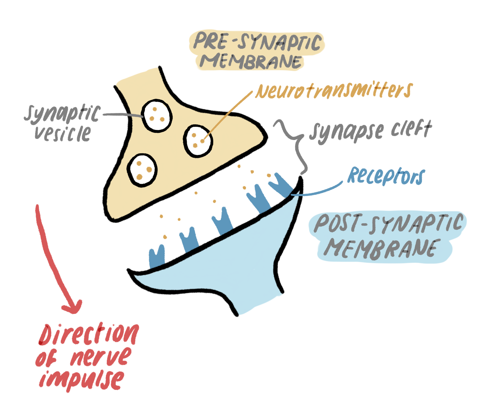
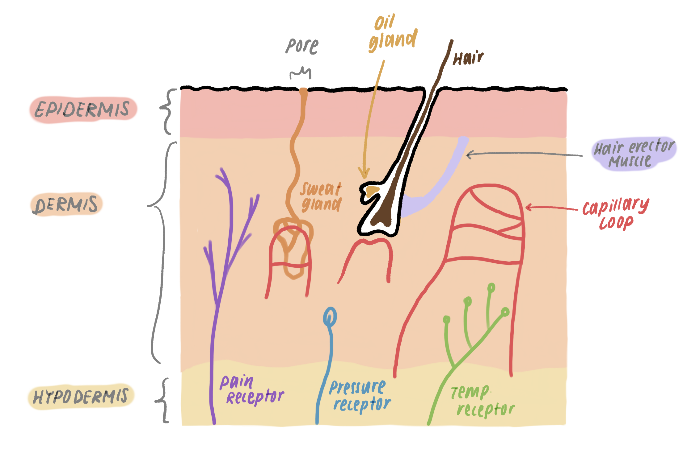
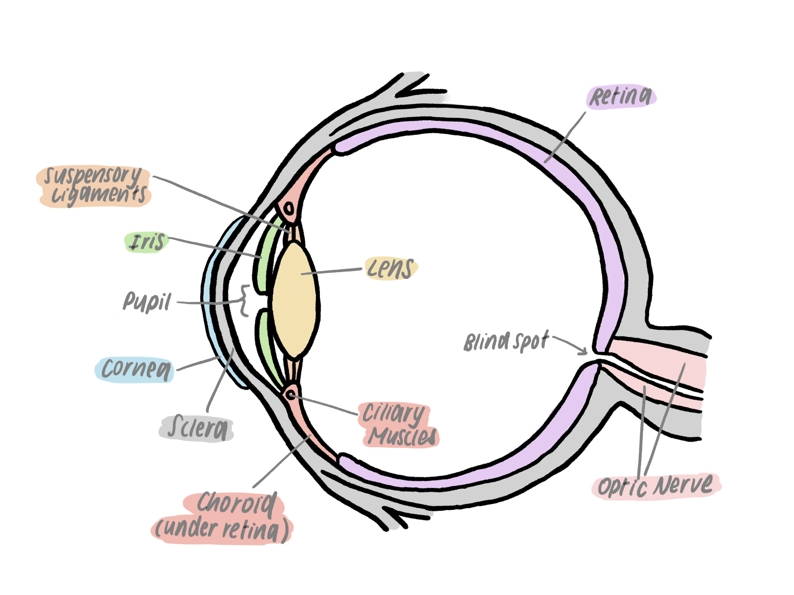
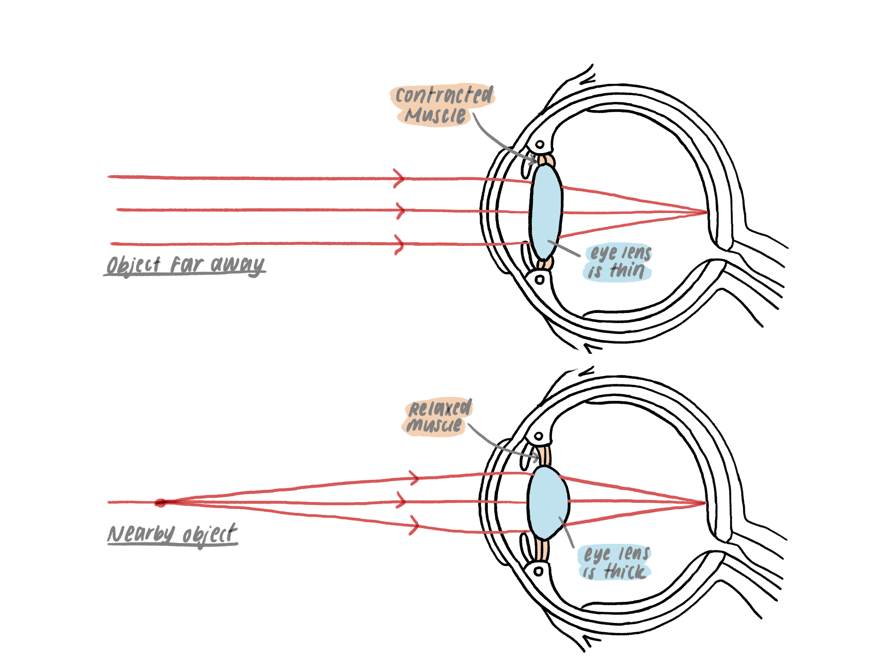
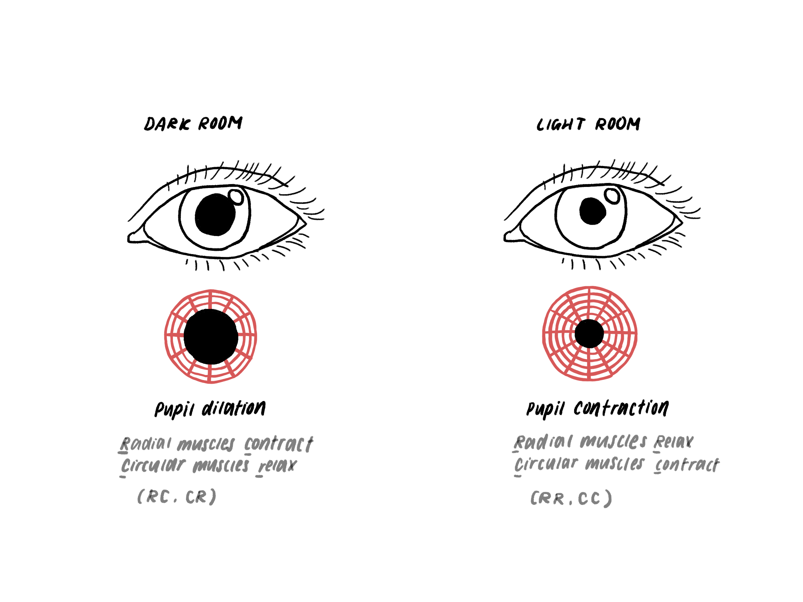
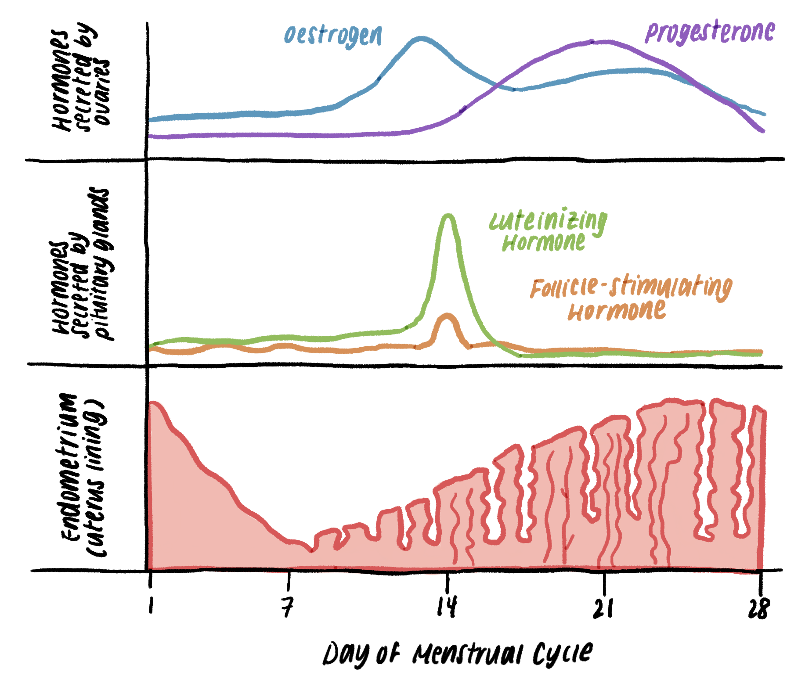

*2.80 understand how organisms are able to respond to changes in their
environment*

*2.81 understand that homeostasis is the maintenance of a constant internal
environment, and that body water content and body temperature are both examples
of homeostasis*

*2.82 understand that a co-ordinated response requires a stimulus, a receptor
and an effector*

**Humans**

*2.86 describe how nervous and hormonal communication control responses and
understand the differences between the two systems*

*2.87 understand that the central nervous system consists of the brain and
spinal cord and is linked to sense organs by nerves*

*2.88 understand that stimulation of receptors in the sense organs sends
electrical impulses along nerves into and out of the central nervous system,
resulting in rapid responses*

*2.89 understand the role of neurotransmitters at synapses*

*2.90 describe the structure and functioning of a simple reflex arc illustrated
by the withdrawal of a finger from a hot object*

*2.91 describe the structure and function of the eye as a receptor*

*2.92 understand the function of the eye in focusing on near and distant
objects, and in responding to changes in light intensity*

*2.93 describe the role of the skin in temperature regulation, with reference to
sweating, vasoconstriction and vasodilation*

*2.94 understand the sources, roles and effects of the following hormones:
adrenaline, insulin, testosterone, progesterone and oestrogen*

*2.95B understand the sources, roles and effects of the following hormones: ADH,
FSH and LH*

 

**This is a very large unit! I personally split it into:**

1.  **Reflexes+CNS**

2.  **Homeostasis**

3.  **Hormones**

**to make it less confusing when revising.**

**It’s important you can label these diagrams without any stimuli. Occasionally
there are exam questions where you’re given a diagram from this unit and you
have to label certain parts so make sure you revise it with active recall.**

 

Reflexes
--------

**Reflex** = action preformed without conscious thought as a response to a
stimulus

### Reflex arc

1.  **Stimulus** = change in internal or external environment, event that
    stimulates a functional reaction in an organ, tissue, limb, muscle, gland
    etc.

2.  **Receptor** = found in sense organs. When stimulated, the receptor sends
    electrical impulses along nerves in the central nervous system, leading to
    **rapid responses**.

    eg. light receptor in the eye (retina)

3.  **​Effector** = the organ, tissue, limb, muscle or gland which acts in
    **response** to a stimulus and to return the change in environment back to
    normal.

eg.

1.  Touch a hot object with finger

2.  Pain receptors in the skin detect the heat. Information is sent through the
    spinal cord and signaled to the brain.

3.  Muscles in the arm/hand contract to pull the finger away from the hot
    object.

 

Central nervous system
----------------------

When a receptor is stimulated, the sense organ will send electrical impulses
through nerves into and out of the central nervous system.

-   **Brain** and **spinal cord** make up the CNS

-   They allow for **rapid responses** to changes in the internal/external
    environment

-   It is a **network of neurons** = nerve cells which carry electrical
    impulses. Impulses are passed along from one neuron to the next.

-   Nervous impulses are generated in **receptor cells** in the receptor organ

-   Receptors send changes in environment as information in electrical impulses

-   The impulses are carried along 3 types of neurons (sensory, relay and
    motor), from the receptor to the muscle or gland (effector)

 

### Movement of impulses through the body

1.  Stimulus is detected by a receptor

2.  Receptor generates impulses in the sensory neurons

3.  Impulses enter the CNS through part of the spinal nerve called the **dorsal
    root**

4.  Sensory neurons in the spinal cord connect to short relay neurons by
    synapses

5.  The relay neurons connect with motor neurons

6.  Motor neurons emerge from the spinal cord through the **ventral root**

7.  Motor neurons transport impulses to the muscle or gland (effector)

 

*Tip to remembering the order of dorsal and ventral root:*

*Dorsal comes first because ‘d’ is before ‘v’ in the alphabet!*

 

### Neurons

*you only need to know the structure of the sensory and motor neuron, not relay*

 

**Motor neuron**

-   Passes electrical impulses from the CNS to the effector

**Sensory neuron**

-   Nerve cells responsible for passing electrical impulses from the receptor to
    the effector

**Dendron**

-   Forms finer extensions called **dendrites** where there are junctions with
    other neurons called **synapses**

 

**Axon**

-   Central part of the neuron

-   Carries the electrical impulses to the effector organ

 

**Myelin sheath**

-   **Insulates** the axon

-   Speeds up the conduction of impulses

 

**Terminal ends**

-   Fine nerve endings of the axon

-   Connects to muscle at a special synapse called the **neuromuscular
    junction**

    -   Where impulses are carried from the CNS to the muscle

 

### Synapse

= gap between 2 neurons

-   Nerve impulses cannot cross synapses. Instead, information is passed across
    the synapse with **chemical messengers called neurotransmitters**

**Process**

1.  Impulse arrives at the end of the **presynaptic neuron**

2.  Neurotransmitters are released into the synapse

3.  The chemical messenger moves across the synapse by diffusion

4.  Synapse is only 20 nanometers wide so it has a very short diffusion distance
    and time

5.  On the **postsynaptic membrane**, the neurotransmitter binds to a receptor
    molecule

6.  When binding, it stimulates a new nerve impulse in the postsynaptic neuron

7.  When levels of the neurotransmitter in the synapse decrease, stimulation of
    the postsynaptic neuron ends

8.  The chemical messenger is reabsorbed back into the presynaptic neuron to be
    reused

9.  The neurotransmitter is broken down by an enzyme. The products are used to
    re-synthesise more neurotransmitters.

 

**Why can the electrical impulse only travel in one direction?**

-   Because the neurotransmitters can only move in one direction:

-   The presynaptic membrane has no receptors

-   There are no neurotransmitters in the postsynaptic membrane

 

 

Homeostasis
-----------

= Maintaining a constant internal environment

-   All organisms that are alive can respond to changes in their environment
    (Sensitivity from MRS GRENC)

 

### Homeotherms

-   Warm blooded organisms

-   Maintain body temperature despite changes in the surrounding environment

-   Physiological changes allow the body to generate or lose heat + maintain
    body temperature

-   Ensures chemical reactions can continue to take place at steady, predictable
    rates

-   Prevents denaturing of enzymes

 

### Skin and temperature control

**Epidermis**

-   Dead cells which stop water loss and protect the body against microorganism
    invasion

 

**Dermis**

-   Contains sensory receptors

-   Location of sweat glands, small blood vessels and hair follicles which are
    all used in temperature control

 

**Hypodermis**

-   Fatty tissue, store of energy

-   Insulates the body against heat loss

 

**Sweat glands**

-   Produces greater amount of sweat when body temperature rises

-   Secreted sweat is at body temperature. It has to get warmer to evaporate.

    -   This energy is supplied by the the body’s heat

    -   When sweat evaporates, it takes some of the body’s heat and provides a
        cooling action.

-   Energy causing evaporation is called the **latent heat of vaporisation**

-   In humid atmosphere, the sweat will stay on the skin as it cannot evaporate
    so it has very little cooling effect.

 

**Hair follicles**

-   In cold conditions, the hairs on the skin surface are pulled uptight

    -   They trap a layer of air next to the skin

    -   As air is a poor conductor, the layer acts as insulation

-   Hair erector muscles attached to the base of each hair relax (so the hair
    lies flat) or contract (so the hair is held uptight)

-   In hot conditions, the hairs on the surface lie flat to allow more heat loss

-   This is not an effective temperature control method as the hairs are not
    very large and not in great enough quantity

 

**Blood vessels**

-   There are tiny blood vessels called capillary loops in the dermis

-   When blood flows through them, it radiates heat to the outside and cools the
    body

-   Vasodilation occurs in hot conditions

    -   Arterioles leading to the capillary loops widen to increase flow to the
        surface

    -   More heat is radiated by the capillary loops

-   Vasoconstriction occurs in cold conditions

    -   Arterioles leading to the surface capillaries constrict so blood flow is
        reduced

    -   Less heat is lost by radiation

 

\*insert diagram of vasodilation and vasocontriction\*

 

**Metabolism**

-   In cold conditions, the body’s metabolism speeds up, stimulated by
    adrenaline hormone

-   Generates more heat from large organs like the liver

-   Shivering also occurs (rapid contraction and relaxation of the muscle) which
    generates heat energy

 

 

The Eye
-------

**Sclera**

-   Tough outer coat of the eye

-   Becomes transparent at the front, called the\*\* cornea \*\*(which lets
    light into the eye)

 

**Iris**

-   Flat, coloured ring-shaped membrane

-   Located behind the cornea

-   Has a hole called the **pupil** where light passes through

-   Controls the amount of light that enters by changing the size of the pupil

-   Has 2 types of muscles which change the pupil size

    -   Circular muscles

    -   Radial muscles

 

**Choroid**

-   Contains **pigment cells** and blood vessels which prevent light being
    reflected inside the eye

-   Located underneath the sclera.

 

**Retina**

-   Inner most layer of the eye.

-   **Light-sensitive**, is where the light energy is converted into electrical
    energy of nerve impulses (light receptor)

-   Contains **receptor cells** called rods and cones which react to light by
    producing impulses in sensory neurons.

    -   Impulses are passed to the brain by the **optical nerve**

-   Rods work well in dim light but cannot distinguish colours. Cones can
    distinguish colors but don’t work well in dim light.

-   Rods and cones are found throughout the retina but cones are concentrated in
    the **fovea** (area at the centre of the retina)

 

### Accomodation

-   = Changes which take place to allow us to see objects at different distances

-   Focusing on a distant object:

    -   Ciliary muscles relax

    -   Suspensory ligaments are pulled tight

    -   Lens becomes flat

-   Opposite for focusing on near object

 

### Changes in response to light intensity

-   The iris controls the amount of light which enters the pupil by changing its
    size

-   It is important the pupil restricts in bright light to let in less light:
    light that is too bright can damage rods and cones

-   In bright light:

    -   **C**ircular muscles **c**ontract (CC)

    -   **R**adial muscles **r**elax (RR)

    -   Pupil constricts

-   Opposite for dim light

-   This is a reflexive action. The intensity of light hitting the retina is the
    stimulus, and the retina is the receptor

 

Hormones
--------

 

-   Help regulate metabolic processes throughout the body

-   Secreted into the blood through endocrine glands

-   Transported through the blood to organs

 

**Negative feedback loop**: increase in hormone decreases the substance being
controlled (e.g. Increased insulin decreases blood glucose concentration)

 

### Adrenaline

-   Released by **adrenal glands**

-   Controlled by positive feedback

-   Release of adrenaline into the bloodstream causes:

    -   increase in breathing rate and depth of breathing by expanding the
        passages of the lungs

    -   leads to increase in heart rate, blood flow

    -   increased volume of blood pumped due to greater blood pressure

    -   pupils dilate

    -   blood vessels supplying muscles dilate

    -   converts glycogen to glucose in the liver to increase blood glucose (for
        aerobic respiration)

-   Results in more glucose and oxygen being transported to the muscles. More
    aerobic respiration occurs so greater amount of energy is released

-   Prepares the body for a fight or flight response (allow quick response when
    in danger)

 

### Insulin

-   Controls blood glucose concentration

    -   If blood glucose is too high, cells get damaged because water is lost by
        osmosis

-   Negative feedback loop

-   Process of controlling blood glucose concentration:

    -   Pancreas continuously monitors blood glucose conc.

    -   After a meal with high carbohydrate, blood glucose increases (as glucose
        is absorbed from the ileum)

    -   Pancreas makes insulin

    -   Insulin decreases blood glucose concentration

        -   increases glucose absorption from the blood by the liver and muscles

        -   converts the excess glucose into glycogen which is mostly stored in
            the liver (but also some muscles)

        -   increase respiration in the liver to use more glucose

    -   Return to normal glucose concentration

-   If blood glucose concentration is too low, less insulin is produced by the
    pancreas

 

### ADH

-   Stands for anti-diuretic hormone

-   Made by the **pituitary gland**

-   Controls blood water content (internal hydration) by a negative feedback
    loop

-   Hypothalamus (part of the brain) detects a change in blood water content. If
    there is too much water, the pituitary gland releases less ADH

    -   Less ADH means the nephron reabsorbs less water back into the blood.

 

### Testosterone

-   Produced in testes

-   Main male reproductive hormone, controls male **secondary sexual
    characteristics**

-   Stimulates sperm production

 

 

### Progesterone

-   Important in the menstrual cycle

-   Produced in ovary

-   Completes the development of the uterus lining - thickens and maintains the
    uterus lining to prepare for implantation of embryo

-   If the egg is not fertilised, the corpus luteum breaks down and stops making
    progesterone

 

### Oestrogen

-   Involved in repairing + thickening the uterus lining in the menstrual cycle

-   Produced in the ovary

-   Stimulates production of LH and stops production of FSH

-   Controls female **secondary sexual characteristics**

 

### FSH

-   Stands for follicle stimulating hormone

-   Produced in the pituitary gland

-   Stimulates maturing of an egg in the ovary

 

### LH

-   Stands for luteinising hormone

-   Produced in pituitary gland

-   Stops the maturing of an egg cell in the ovary and triggers ovulation
    (releasing of the egg into the Fallopian tubes)

 

**If you’re confused about the female hormones, go check out our article on
reproduction where I explain it in further detail :)**

 

### Table to summarise hormones

| **Hormone**  | **Gland** | **Target organs**          | **Use**                                                                                                                                                                  |
|--------------|-----------|----------------------------|--------------------------------------------------------------------------------------------------------------------------------------------------------------------------|
| Adrenaline   | Adrenal   | Liver, heart               | Prepare the body for ‘fight or flight’ response when in danger                                                                                                           |
| Insulin      | Pancreas  | Liver                      | Control blood glucose levels                                                                                                                                             |
| ADH          | Pituitary | Kidney                     | Control blood water content                                                                                                                                              |
| Testosterone | Testes    | Male reproductive organs   | Stimulates sperm production, controls secondary sexual characteristics in males                                                                                          |
| Progesterone | Ovary     | Uterus                     | Maintains uterus lining during menstrual cycle and pregnancy.                                                                                                            |
| Oestrogen    | Ovary     | Female reproductive organs | Stops maturing of egg by stopping FSH production. Stimulates pituitary gland to produce LH. Thickens uterus lining. Controls secondary sexual characteristics in females |
| FSH          | Pituitary | Ovaries                    | Causes maturing of an egg in the ovary + stimulates ovaries to produce oestrogen                                                                                         |
| LH           | Pituitary | Ovaries                    | Triggers ovulation of matured egg                                                                                                                                        |
